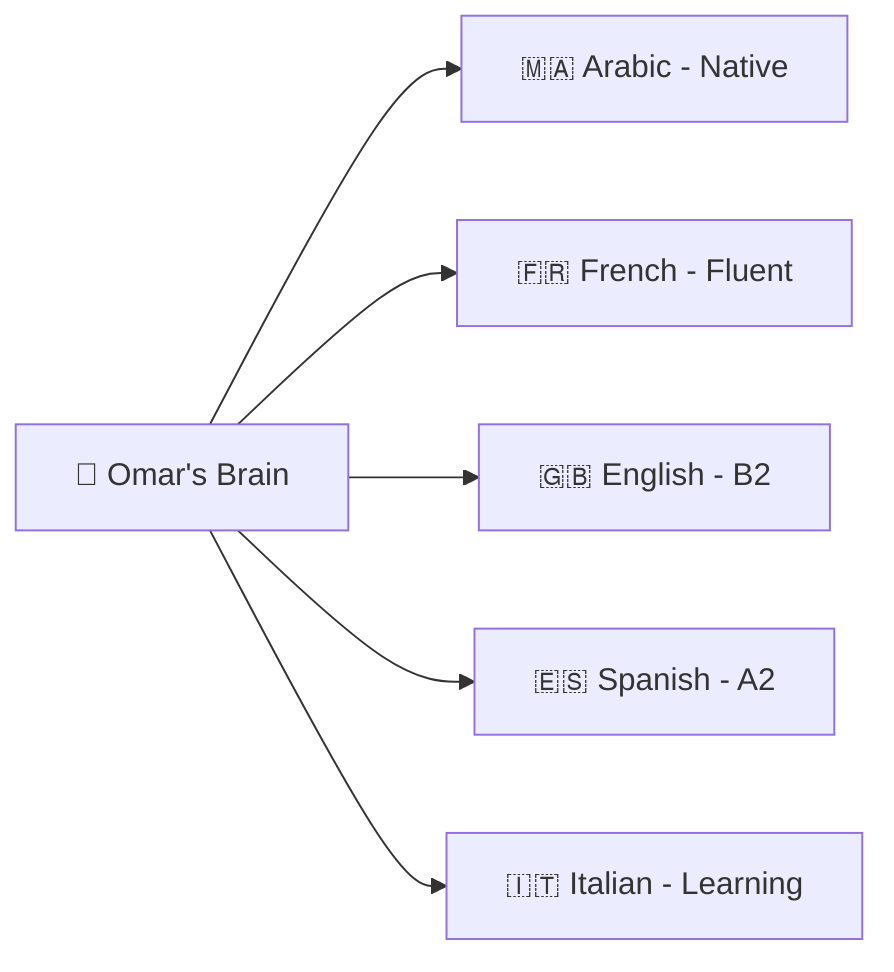

<div align="center">
  
# 🌌 Welcome to My Digital Universe 🌌


</div>

---

<div align="center">
  
### ✨ *"Transforming Ideas into Code, One Line at a Time"* ✨

</div>

---


### 🎭 **Who Am I?**

```python
class OmarFarouk:
    def __init__(self):
        self.name = "Omar Farouk LASFAR"
        self.role = "Student & Future Developer"
        self.location = "Strasbourg, France 🇫🇷"
        self.university = "IUT Robert Schuman"
        self.degree = "BUT Informatique (2nd Year)"
        self.life_philosophy = "Code, Learn, Grow, Repeat"
        
    def currently_learning(self):
        return ["Cloud Computing ☁️", "Machine Learning 🤖", "Advanced Algorithms 🧮"]
    
    def fun_fact(self):
        return "I coach football and code with the same passion! ⚽💻"
```

---

<div align="center">
  
## 🛸 **Tech Arsenal** 🛸


</div>

<div align="center">

### 🎨 **Languages & Frameworks**


### 🛠️ **Tools & Technologies**


</div>

---

<div align="center">
  
## 🌟 **Epic Projects** 🌟

</div>

<table align="center">
<tr>
<td width="50%" align="center">

### 🏢 **Kalypso**
**Business Management Simulator**


`Strategy` `Production` `Sales`

*Complex enterprise simulation system*

</td>
<td width="50%" align="center">

### 🌐 **Khidmati**
**Full-Stack Web Platform**


`React` `SQL` `User Management`

*Modern web application with complete user system*

</td>
</tr>
<tr>
<td width="50%" align="center">

### 🚒 **Fire Station Manager**
**C#.NET Management System**


`C#` `.NET` `Database`

*Personnel & mission management solution*

</td>
<td width="50%" align="center">

### 🚀 **More Coming Soon**
**The Journey Continues...**


`Innovation` `Learning` `Creating`

*Building the future, one project at a time*

</td>
</tr>
</table>

---

<div align="center">

## 🏆 **Achievements Unlocked** 🏆

 **Python Programming Master** - 31.5 Hours Completed

 **Cloud Computing Explorer** - AWS Certified

 **Machine Learning Apprentice** - Google Certified

 **Cybersecurity Aware** - HP LIFE

</div>

---

<div align="center">

## 🌍 **Language Matrix** 🌍


```mermaid
graph LR
    A[🧠 Omar's Brain] --> B[🇲🇦 Arabic - Native]
    A --> C[🇫🇷 French - Fluent]
    A --> D[🇬🇧 English - B2]
    A --> E[🇪🇸 Spanish - A2]
    A --> F[🇮🇹 Italian - Learning]
```

</div>

---

<div align="center">

## 💫 **Life Beyond Code** 💫

### ⚽ **Football Coach** (2020-2024)
*Leading teams to victory, on and off the field*

### 🤝 **Community Hero** (2023-2024)
*Making a difference, one smile at a time*


</div>

---

<div align="center">

## 📊 **GitHub Analytics** 📊


</div>

---

<div align="center">

## 🎮 **Level Up With Me** 🎮


### 📮 **Reach Out to My Digital Realm** 📮

**📧 Email:** `Oflasfar@gmail.com`  
**💼 LinkedIn:** `omar-farouk-lasfar`  
**📱 Phone:** `+33 7 44 75 86 55`

</div>

---

<div align="center">


### 🌟 *"Currently seeking an internship to transform passion into profession"* 🌟


</div>

---

<div align="center">
  
**</>** with 💜 by Omar Farouk LASFAR


</div>
